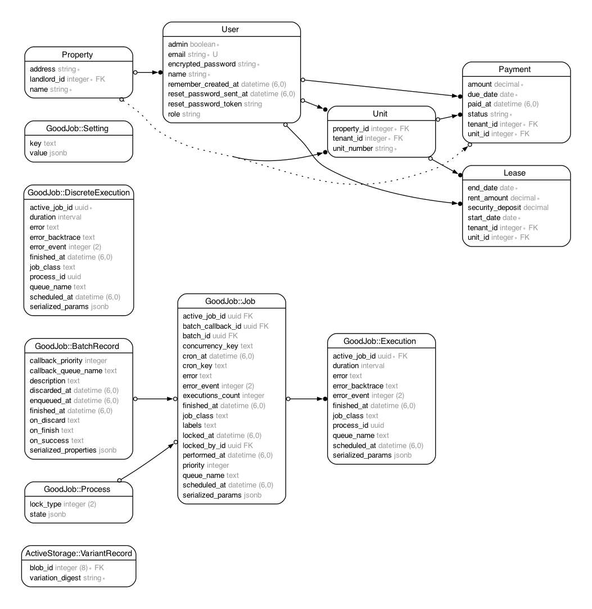

# RentPilot

## Description 📖
RentPilot is a user-friendly web application designed to streamline rent tracking and tenant communication for property managers, ensuring efficient and automated management of rental payments and tenant interactions.

## Table of Contents 📚
- [RentPilot](#rentpilot)
  - [Description 📖](#description-)
  - [Table of Contents 📚](#table-of-contents-)
  - [Features 📲](#features-)
  - [Setup Instructions](#setup-instructions)
    - [Prerequisites](#prerequisites)
  - [Installation 🛠️](#installation-️)
  - [Configuration](#configuration)
  - [Entity Relationship Diagram (ERD)](#entity-relationship-diagram-erd)
  - [Usage](#usage)
  - [Visual Aid](#visual-aid)
    - [\[Click to Watch Demo Video Here\]](#click-to-watch-demo-video-here)
  - [Contributing 🧑‍🔧](#contributing-)
    - [Coding Conventions](#coding-conventions)
    - [Comments and Documentation](#comments-and-documentation)
    - [Version Control Practices](#version-control-practices)
    - [Branch Naming Conventions](#branch-naming-conventions)
    - [Pull Request Process](#pull-request-process)
  - [FAQ 🙋](#faq-)
    - [Ruby Version Errors](#ruby-version-errors)
  - [TroubleShooting](#troubleshooting)
  - [License](#license)
  - [Contact](#contact)

## Features 📲
- Rent payment tracking
- Tenant payment portal
- Automated payment reminders

## Setup Instructions

### Prerequisites
- Ruby `3.2.1`
- Rails `7.1.3`
- Bootstrap `5.3.3`
- PostgreSQL

## Installation 🛠️

1. Clone the repository:
`git clone https://github.com/kcalva/RentPilot.git`

2. Navigate to the project directory:
`cd RentPilot`

3. Install the required gems:
`bundle install`

4. Set up the database:
`rails db:setup`

5. Start the Rails server:
`rails server`


## Configuration
To configure your application using the email provider Postmark:
* create a `.env` file in the root of the project and add the following environment variables:
```env
POSTMARK_API_KEY=your-postmark-api-key
```
## Entity Relationship Diagram (ERD)



## Usage
1. Run `rake dev:sample_data` to see sample data
2. Start the Rails server:
`rails server`

3. Open your browser and navigate to http://localhost:3000

- When you try to create an account it will default to role of tenant, so you won't be able to see much when logging in (only view accessiblity).
- Only role of landlords has permissions to create,edit,update and delete data.
- You will need admin (owner of app) to change your role in order to be a landlord.

For now if you want to look at how it will look as landlord use this sample user

* Email: `landlord-kevin@example.com`
* Password: `password`

## Visual Aid
### [[Click to Watch Demo Video Here]](/app/assets/videos/demo_video.mp4)


## Contributing 🧑‍🔧

Contributions are welcome! Please follow these guidelines:

**Find an issue to work on and then:**
1. Fork the repository
2. Create a new branch (`git checkout -b feature-branch`)
3. Commit your changes (`git commit -m 'Add some feature'`)
4. Push to the branch (`git push origin feature-branch`)
5. Open a pull request

### Coding Conventions
We adhere to the Ruby community style guide, and we expect all contributors to follow suit. Here are key conventions specific to our project:

- **Code Style**: Follow the [Ruby Style Guide](https://rubystyle.guide/), which provides detailed guidelines on the coding style preferred by the Ruby community.
- **Naming Conventions**:
  - Use `snake_case` for variables, methods, and file names.
  - Use `PascalCase` for class and module names.
  - Reflect domain concepts accurately in naming. For instance, if you are working within a financial application, prefer names like `user_account_details` over vague terms like `data`.

- **Design Principles**: Focus on Domain-Driven Design (DDD):
  - Organize code to reflect the domain model clearly.
  - Use service objects, decorators, and other design patterns that help isolate domain logic from application logic.

### Comments and Documentation
- **Comment your code** where necessary to explain "why" something is done, not "what" is done—source code should be self-explanatory regarding the "what".
- **Document methods and classes** thoroughly, focusing on their roles within the domain model, especially for public APIs.

### Version Control Practices
- Commit messages should be clear and follow best practices, such as those outlined in [How to Write a Git Commit Message](https://chris.beams.io/posts/git-commit/).
- Keep commits focused on a single issue to simplify future maintenance and troubleshooting.

### Branch Naming Conventions
Please use the following naming conventions for your branches:

- `<issue#-initals-description>` (i.e 31-kc-added-pagination)

### Pull Request Process
1. **Creating a Pull Request**: Provide a detailed PR description, referencing the issue it addresses.
2. **Review Process**: PRs require review from at least one maintainer.

## FAQ 🙋

### Ruby Version Errors
* The project is written using Ruby 3.2.1, if you encounter issues upon cloning, make sure you have Ruby version 3.2.1 in your environment, also see the [Ruby Language docs.](https://www.ruby-lang.org/en/documentation/)

## TroubleShooting
* **Missing Dependencies:**
Run `bundle install` if you encounter issues with missing gems or packages.
## License
Distributed under the MIT License. See `LICENSE` for more information.

## Contact

Kevin Calva - [kcalva737@gmail.com](mailto:kcalva737@gmail.com)
Project Link: [https://github.com/users/kcalva/projects/1](https://github.com/users/kcalva/projects/1)
